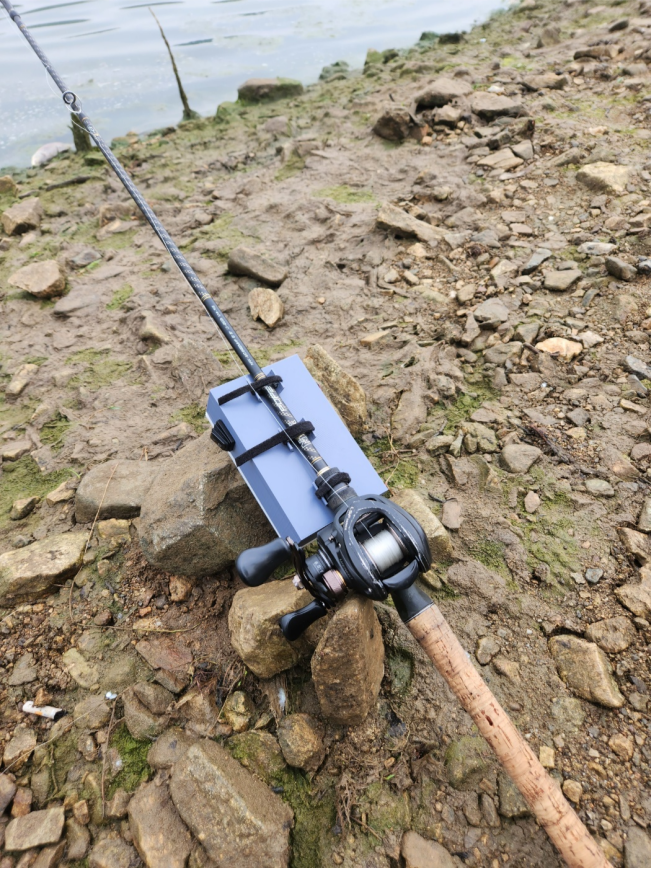
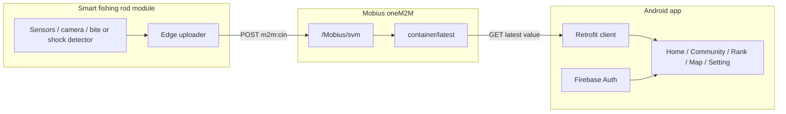
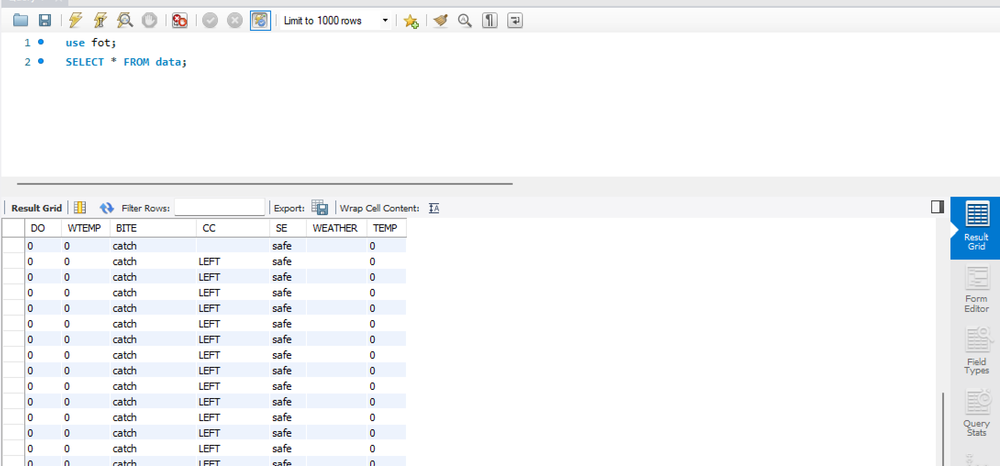
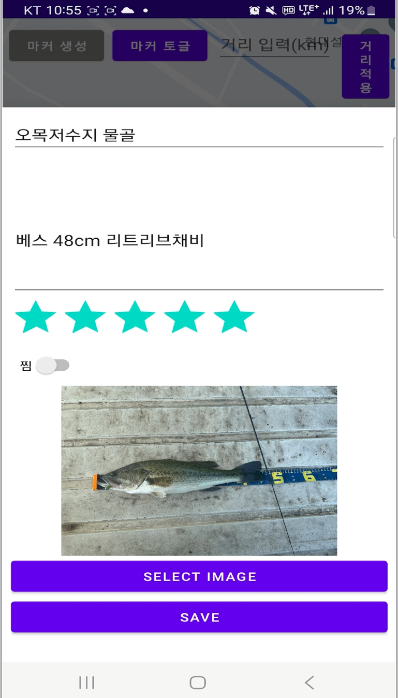

# 낚신 (Fishingod)

<div align="center">
  

  <p><strong>스마트 낚싯대 센서 데이터를 Android 앱에서 확인하는 IoT 낚시 모니터링 프로젝트</strong></p>

  <p>
    
    
    
    
    
  </p>
</div>

## Overview

`낚신`은 낚시 초보자와 동호인이 현장에서 필요한 정보를 한 번에 확인할 수 있도록 만든 스마트 낚시 보조 앱입니다. 낚싯대에 장착한 센서 모듈과 Mobius oneM2M 서버를 연결해 입질/충격 이벤트, 장치 상태, 현장 기록을 Android 앱에서 확인하는 흐름을 목표로 합니다.

이 저장소는 Android 클라이언트와 프로젝트 산출물 사진을 포함합니다. 앱은 Firebase 로그인, 하단 탭 기반 화면 전환, Retrofit 기반 Mobius API 조회, Google Maps 화면, 알림 채널을 사용합니다.

## Key Features

| 영역 | 기능 |
| --- | --- |
| Home | 낚시 장치 상태를 요약하고 상세 화면으로 이동 |
| Alert | Mobius `vibration` 컨테이너를 주기적으로 확인해 이벤트 발생 시 알림 |
| Device Detail | `ultrasonic`, `loadcell` 등 센서 컨테이너의 최신값 조회 |
| Camera/Record | Base64 이미지 컨테이너를 디코딩해 기록 이미지 표시 |
| Community | 커뮤니티 탭을 위한 화면 구조 |
| Rank | 낚시 기록/랭킹 탭을 위한 화면 구조 |
| Map | Google Maps SDK 기반 낚시 포인트 화면 |
| Auth | Firebase Authentication 기반 이메일 로그인/가입 흐름 |

## Architecture



## Tech Stack

| Area | Stack |
| --- | --- |
| Language | Kotlin |
| Android | AndroidX, ViewBinding, ConstraintLayout, ViewPager2, BottomNavigationView |
| Network | Retrofit 2.9.0, Gson Converter |
| Auth/Analytics | Firebase Auth, Firebase Analytics |
| Map | Google Maps SDK, Secrets Gradle Plugin |
| IoT Server | Mobius oneM2M HTTP API |
| Build Target | minSdk 26, targetSdk 32, compileSdk 32 |

## Repository Map

```text
.
├── app
│   ├── google-services.example.json
│   ├── build.gradle
│   └── src/main
│       ├── AndroidManifest.xml
│       ├── java/com/Team/smartfishing
│       │   ├── MainActivity.kt
│       │   ├── data/remote
│       │   └── feature
│       │       ├── community
│       │       ├── home
│       │       ├── map
│       │       ├── rank
│       │       └── setting
│       └── res
├── docs
│   ├── work-photos
│   └── work-photos-selected
├── local.properties.example
└── README.md
```

## Configuration

민감한 값은 공개 저장소에 커밋하지 않고 `local.properties`에서 주입합니다.

1. `local.properties.example`을 `local.properties`로 복사합니다.
2. Google Maps Android API key를 `MAPS_API_KEY`에 입력합니다.
3. Mobius 서버 주소와 origin 값을 입력합니다.
4. Firebase 콘솔에서 받은 실제 `google-services.json`을 `app/google-services.json`에 둡니다.

```properties
MAPS_API_KEY=YOUR_GOOGLE_MAPS_ANDROID_API_KEY
MOBIUS_BASE_URL=http://YOUR_MOBIUS_HOST:7579/
MOBIUS_ORIGIN=YOUR_MOBIUS_ORIGIN
```

`local.properties`와 `app/google-services.json`은 `.gitignore`에 포함되어 있어 공개 레포에 올라가지 않습니다.

## Getting Started

```bash
git clone https://github.com/nemonamo/Smartfishing-Fishingod-.git
cd Smartfishing-Fishingod-
```

1. Android Studio에서 프로젝트를 엽니다.
2. 위 `Configuration` 섹션에 따라 `local.properties`와 `app/google-services.json`을 준비합니다.
3. Gradle Sync를 실행합니다.
4. Android 기기 또는 에뮬레이터에서 앱을 실행합니다.

## Project Gallery

| Prototype | App Dashboard | Record Screen | Waterproof Test |
| --- | --- | --- | --- |
|  |  |  |  |

## Security Notes

- 실제 Google Maps API key와 Firebase `google-services.json`은 커밋하지 않습니다.
- Mobius 서버 주소와 `X-M2M-Origin`은 `local.properties`에서 빌드 시점에 주입합니다.
- 공개 README에는 실서버 주소나 운영용 origin 값을 적지 않습니다.

## Status

이 프로젝트는 스마트 낚싯대 아이디어를 Android 앱과 IoT 서버 연동 구조로 구현한 포트폴리오/프로토타입입니다. 현재 코드는 화면 구조, 로그인, 지도, Mobius 조회, 이벤트 알림 흐름을 중심으로 구성되어 있습니다.
