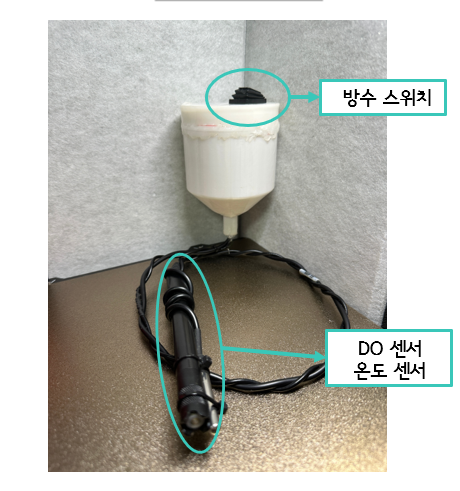
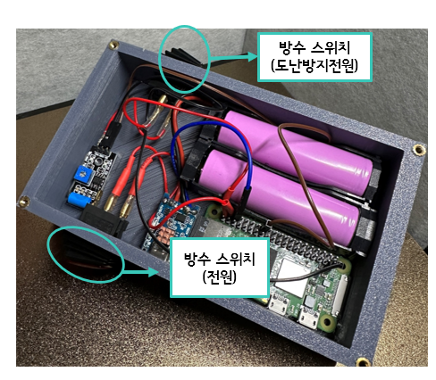
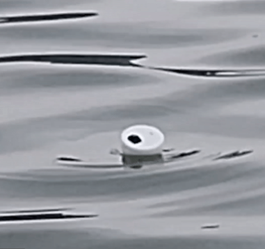
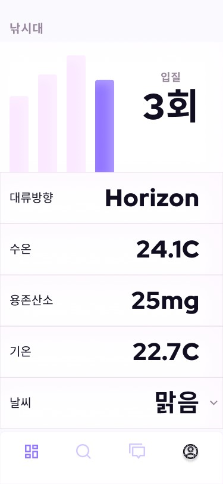

# 낚신 (Smart Fishing Rod) Android App

> 순천향대학교 졸업작품 포트폴리오 저장소

`낚신`은 낚시 상황을 한 번에 확인할 수 있는 모바일 모니터링 앱입니다.  
센서 기반 상태값(수온, 용존산소, 입질 감지 등)과 장치 상태를 조회하고, 위험 상황(도난/입질) 발생 시 알림으로 전달하는 것을 목표로 합니다.

###  작품아이디어

- 낚시 초보자/숙련자 모두를 위한 시각·청각 보조형 앱
- 낚싯대 장착 시 스마트낚싯대로 전환되는 개념
- 수온, 용존산소, 입질 감지, 대류방향 같은 수집 데이터 제공
- 도난/이탈 상황 알림
- 입질 발생 시 찌 점멸 + 앱 알림
- 물고기 기록 기반 지도/랭킹 연계 아이디어
- 
## 주요 구성

- 하단 탭 기반 화면 전환(Home / Community / Rank / Map / Setting)
- Firebase 인증 기반 로그인 흐름
- Retrofit 기반 API 통신으로 상태값 조회
- 홈 화면에서 요약 정보 노출 및 상세 화면으로 이동
- 알림 채널 초기화 및 백그라운드 감지 흐름(실험적/진행 중)

## 기술 스택

- Language: Kotlin
- UI: AndroidX, ViewBinding, ConstraintLayout, ViewPager2, BottomNavigation
- Network: Retrofit 2.9.0 + Gson Converter
- Authentication: Firebase Auth
- Mapping: Google Maps SDK (API 키 필요)
- Target: Android (minSdk 26, compileSdk/targetSdk 32)

## 프로젝트 핵심 포인트 (README 요약용)

- 실시간에 가까운 상태 조회를 위해 폴링 기반 호출 구조를 사용
- 상태 알림을 위한 알림 채널 및 플래그 기반 진동/이벤트 처리
- 로그인(회원가입/로그인)과 메인 대시보드 흐름 분리
- 주요 API 화면: 홈, 보관 상태(현재량), 보안(이미지), 청소/기록
- 낚시 현장 운용을 위한 단말·센서 데이터 화면 흐름

###  작품사진

.PNG)

